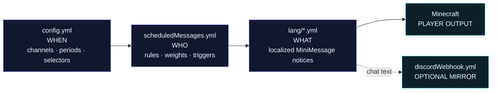

<p align="center">
  
</p>

<p align="center">
  <a href="https://github.com/imDMK/AutoMessage/releases"></a>
  <a href="https://github.com/imDMK/AutoMessage/actions/workflows/gradle.yml"></a>
  
  
  
</p>

<p align="center">
  <a href="https://modrinth.com/plugin/automessage"></a>
  <a href="https://www.spigotmc.org/resources/automessage.112363/"></a>
  <a href="https://hangar.papermc.io/imDMK/AutoMessage"></a>
</p>

<p align="center">
  <strong>Not another chat rotator. A complete announcement engine.</strong><br>
  Targeted, localized and event-aware broadcasts for modern Minecraft servers and networks.
</p>

<p align="center">
  <a href="#get-automessage"><strong>Get AutoMessage</strong></a>
  ·
  <a href="#quick-start"><strong>Quick start</strong></a>
  ·
  <a href="#configuration-model"><strong>Configuration</strong></a>
  ·
  <a href="#platform-support"><strong>Platforms</strong></a>
  ·
  <a href="#reference"><strong>Reference</strong></a>
</p>

## 📣 Broadcasts should earn attention

Players learn to ignore announcements when every message reaches everyone. AutoMessage makes
server communication intentional: give each stream its own schedule, select exactly who should
see it, react to live events, and render the result through the presentation layer that fits.

One announcement can combine **chat, action bar, title, subtitle, boss bar and sound**. Its audience
can be narrowed by **permission, group, world, player count or playtime**. Its content can follow
each player's language, use MiniMessage formatting and placeholders, and optionally mirror to
Discord.

The same core runs across **Bukkit, Folia, Sponge, Velocity, Fabric and Minestom** through a
dedicated artifact for each runtime.

<p align="center">
  
</p>

### A complete announcement, start to finish

Greet returning veterans three seconds after they join — never on a timer, never the newcomers,
and in their own language.

```yaml
# scheduledMessages.yml — who gets it, and when
messages:
  - name: welcome-back
    trigger:
      type: JOIN
      delay: 3s
    rules:
      - type: PLAYTIME
        min: 10h
```

```yaml
# lang/en.yml — what it says
announcements:
  welcome-back:
    - chat: "<gray>Welcome back, <aqua>{PLAYER}<gray>."
      sound: "entity.player.levelup MASTER 1.0 1.2"
```

That is the whole feature set in miniature: an event instead of a clock, an audience instead of
everyone, and text that lives beside every other translation.

## ⚖️ More than a rotating list

The tagline is not marketing. A rotator answers one question — *what do I say next?* — and sends
the answer to everyone, in one language, on one clock.

| | A plain rotator | AutoMessage |
|:--|:--|:--|
| **Who receives it** | Everyone online | Permission, group, world, online count, playtime — composed with `ANY_OF`, `NONE_OF`, `NOT` |
| **When it fires** | One global interval | A schedule per channel, plus `JOIN`, `FIRST_JOIN` and re-arming `PLAYER_COUNT` triggers |
| **What it looks like** | A line of chat | Chat, action bar, title, subtitle, boss bar and sound, combined in one announcement |
| **What it says** | One text for everybody | The player's own language, with a per-message fallback |
| **Where it runs** | One server type | Bukkit, Folia, Sponge, Velocity, Fabric and Minestom, each a native artifact |


### The details underneath

|  |  |  |
|:--|:--|:--|
| **🔀 Four rotation strategies**<br><br>`SHUFFLE`, `SEQUENTIAL`, `RANDOM` or weighted, chosen per channel. Shuffle deals a whole deck before anything repeats. | **🧩 Configuration that fits the runtime**<br><br>A proxy never sees a world rule or a first-join trigger. Options the platform cannot honor are left out of the file, not written and ignored. | **👁 Preview before publishing**<br><br>`/automessage view <name>` renders the real localized message to you alone, ignoring its audience rules. |
| **↗ Beyond the server**<br><br>Mirror chat content to a Discord webhook, with player-only placeholders stripped and automatic mentions disabled. | **♻ Reload, do not restart**<br><br>`/automessage reload` applies schedules, messages and languages in place — including a translation file added while the server was running. | **🪶 Lean dispatch path**<br><br>No database. An empty server short-circuits, and each announcement is scanned for placeholders once rather than once per player. |


## 🌐 One engine. Six runtimes

AutoMessage uses a shared platform-neutral core and a small runtime adapter for each server type.
That means the behavior stays familiar while scheduling, viewers, permissions and lifecycle hooks
remain native to the platform underneath.

<p align="center">
  
</p>

<a id="platform-support"></a>

| Artifact | Runtime | Supported line | Java | Platform-specific notes |
|:--|:--|:--|:--:|:--|
| **Bukkit** | Spigot, Paper, Purpur and other Bukkit-derived servers | Minecraft `1.21–26.2` | 21+ | Full feature set; optional PlaceholderAPI integration |
| **Folia** | Folia | Minecraft `1.21–26.2` | 21+ | Dedicated regionized scheduling; optional PlaceholderAPI integration |
| **Sponge** | Sponge API 17 | Minecraft `1.21.10` | 21+ | Full feature set except PlaceholderAPI |
| **Velocity** | Velocity `3.5.1` proxy | Proxy runtime | 21+ | No world, playtime, first-join or PlaceholderAPI capabilities |
| **Fabric** | Dedicated Fabric server | Minecraft `1.21.11` | 21+ | Server-side mod; Fabric API required; no PlaceholderAPI |
| **Minestom** | Embedded Minestom library | Protocol `1.21.11` | 25+ | Classpath library; no world, playtime, first-join or PlaceholderAPI; permission/group rules require your callback |

> [!NOTE]
> Java 21 is the bytecode floor for the plugin artifacts, not a promise that every Minecraft
> server version runs on Java 21. Use the JVM required by your server; Minestom itself requires
> Java 25.

Each artifact writes a platform-aware configuration. Options the runtime cannot honor are left out
instead of being generated and silently ignored.

<details>
<summary><strong>What about Quilt?</strong></summary>

There is no separate Quilt artifact. Quilt can read Fabric metadata, but this branch does not claim
a tested Quilt version. Treat the Fabric jar on Quilt as experimental and bring a compatible
Fabric API yourself.

</details>

<a id="configuration-model"></a>

## 🗂 Configuration model

AutoMessage separates **when**, **who** and **what**. Adding a language never requires copying
scheduling rules, and changing a channel interval never touches the message text.



| File | Responsibility |
|:--|:--|
| `config.yml` | Master switch, fallback language, channels, startup delays, periods and selectors |
| `scheduledMessages.yml` | Message names, channel assignment, weights, audience rules and event triggers |
| `lang/<code>.yml` | Localized command replies and the actual MiniMessage announcement payloads |
| `discordWebhook.yml` | Opt-in Discord webhook, display name and avatar |

<a id="get-automessage"></a>

## 📥 Get AutoMessage

| What you need | Where to get it |
|:--|:--|
| Current public Bukkit build | [Modrinth](https://modrinth.com/plugin/automessage) · [SpigotMC](https://www.spigotmc.org/resources/automessage.112363/) · [Hangar](https://hangar.papermc.io/imDMK/AutoMessage) |
| Release history and changelogs | [GitHub Releases](https://github.com/imDMK/AutoMessage/releases) |
| Multiplatform artifacts from this branch | [Build all six from source](#building-from-source) |

> [!IMPORTANT]
> **Release status:** this README documents the local multiplatform branch. The current public
> listings still represent the earlier Bukkit-focused release line. Until a new GitHub release
> publishes all six artifacts, build the multiplatform jars with `./gradlew dist`.

<a id="quick-start"></a>

## 🚀 Quick start

1. Get the artifact built for your runtime. Platform jars are intentionally separate.
2. Put it in your platform's `plugins/` or `mods/` directory. For Minestom, add the jar to the
   application classpath and use the builder shown below.
3. Start the server once. AutoMessage generates annotated configuration plus working example
   announcements.
4. Edit `config.yml`, `scheduledMessages.yml` and the files inside `lang/`.
5. Run `/automessage reload`, then test a message with `/automessage view <name>`.

> [!TIP]
> Start with the generated files. They are not empty templates: every available field is explained
> next to a working example, and the contents adapt to the platform that created them.

## 🛠 Build your first announcement

The example below creates an independent event stream, adds one announcement to it, and renders
multiple notice types from a single localized payload.

### 1. Schedule the stream

```yaml
# config.yml
enabled: true
fallbackLanguage: en

channels:
  - name: default
    enabled: true
    initialDelay: 1m
    period: 5m
    selector: SHUFFLE

  - name: events
    enabled: true
    initialDelay: 30s
    period: 15m
    selector: SEQUENTIAL
```

### 2. Register the announcement

```yaml
# scheduledMessages.yml
messages:
  - name: event-night
    channel: events
```

### 3. Design what players receive

```yaml
# lang/en.yml
announcements:
  event-night:
    - chat:
        - "<dark_gray>[<gold>EVENT<dark_gray>] <gray>The arena opens in <gold>5 minutes<gray>."
        - "<gray>Click <click:run_command:'/warp arena'><hover:show_text:'<yellow>Teleport'><aqua><u>here</u></aqua></hover></click> to join."
      actionbar: "<yellow>Prepare your loadout — the event starts soon"
      title: "<gradient:#ffd166:#ff6b6b><bold>EVENT NIGHT</bold></gradient>"
      subtitle: "<gray>The arena opens in 05:00"
      times: "500ms 3s 500ms"
      bossbar:
        message: "<light_purple>Event countdown"
        duration: 10s
        color: PURPLE
        overlay: PROGRESS
        progress: 0.75
      sound: "block.note_block.pling MASTER 1.0 1.0"
```

<p align="center">
  
</p>

Use only the parts that fit the message. A simple chat announcement can be a single string; a
showcase announcement can combine every surface above.

<a id="reference"></a>

## 📖 Reference

<details>
<summary><strong>Announcement channels and selectors</strong></summary>

Every channel has its own schedule and independent selector state:

```yaml
channels:
  - name: tips
    enabled: true
    initialDelay: 1m
    period: 5m
    selector: SHUFFLE

  - name: promotions
    enabled: true
    initialDelay: 2m
    period: 20m
    selector: WEIGHTED
```

| Selector | Behavior |
|:--|:--|
| `SHUFFLE` | Randomizes the order and shows every message once before anything repeats |
| `SEQUENTIAL` | Walks straight through the configured list |
| `RANDOM` | Draws independently; the same message may appear twice in a row |
| `WEIGHTED` | Draws randomly in proportion to each message's `weight` |

`SEQUENTIAL` and `SHUFFLE` keep their position across a normal configuration reload. A weight of
`0` parks a message only in a `WEIGHTED` channel; other selectors do not consult weights.

</details>

<details>
<summary><strong>Audience rules</strong></summary>

Top-level rules behave like logical **AND**. Nest `ANY_OF`, `NONE_OF` and `NOT` when the audience
needs more expressive logic.

| Rule | Matches |
|:--|:--|
| `PERMISSION` | Viewers holding a permission node |
| `GROUP` | Viewers holding `group.<name>`; this is permission-based, not a direct LuckPerms/Vault lookup |
| `WORLD` | Viewers in one of the configured worlds |
| `PLAYER_COUNT` | While the live online count is inside a configured range |
| `PLAYTIME` | Viewers whose native platform playtime is inside a configured duration range |
| `ANY_OF` | At least one nested rule |
| `NONE_OF` | None of the nested rules |
| `NOT` | The inverse of one nested rule |

```yaml
messages:
  - name: vip-event
    channel: events
    rules:
      - type: ANY_OF
        rules:
          - type: PERMISSION
            permission: rank.vip
          - type: PERMISSION
            permission: rank.staff
      - type: PLAYER_COUNT
        min: 10
        max: 100
```

Rules still apply to messages sent by an event trigger. Platform-specific rules are generated only
where the runtime can supply the required data.

</details>

<details>
<summary><strong>Event triggers</strong></summary>

A triggered message leaves its timed channel rotation completely:

```yaml
messages:
  - name: welcome-back
    trigger:
      type: JOIN
      delay: 3s

  - name: first-join-welcome
    trigger:
      type: FIRST_JOIN
      delay: 3s

  - name: one-hundred-online
    trigger:
      type: PLAYER_COUNT
      threshold: 100
```

`PLAYER_COUNT` fires once when the threshold is reached and re-arms only after the online count
drops below it. `FIRST_JOIN` is unavailable on runtimes that do not expose a persistent first-join
signal.

> [!NOTE]
> `/automessage enable` and `/automessage disable` control scheduled channels. Event-triggered
> announcements operate independently.

</details>

<details>
<summary><strong>Languages and fallback behavior</strong></summary>

AutoMessage ships `en`, `pl` and `de`. Add another language by copying a file to
`lang/<code>.yml`, translating it and running `/automessage reload`.

For a player using `pt_br`, AutoMessage looks for:

1. `lang/pt_br.yml`
2. `lang/pt.yml`
3. the `fallbackLanguage` from `config.yml`

A missing announcement falls back individually, so a new translation does not have to be complete
before it is useful.

</details>

<details>
<summary><strong>MiniMessage, placeholders and notification parts</strong></summary>

All text uses [Kyori MiniMessage](https://docs.papermc.io/adventure/minimessage/format/), including colors,
gradients, decorations, hover text and click actions.

Built-in placeholders:

| Player-scoped | Server-scoped |
|:--|:--|
| `{PLAYER}` · `{DISPLAY_NAME}` · `{UUID}` · `{WORLD}` | `{ONLINE}` · `{MAX_PLAYERS}` · `{DATE}` · `{TIME}` |

On Bukkit and Folia, an installed PlaceholderAPI is detected automatically. Standard
`%placeholder_name%` tokens containing letters, digits and underscores can then be used alongside
the built-ins.

Available notification keys:

| Key | Value |
|:--|:--|
| bare string / `chat` | One chat line or a list of lines |
| `actionbar` | MiniMessage text shown above the hotbar |
| `title` / `subtitle` | Title layers; either can be used independently |
| `times` | Three durations: fade in, stay, fade out |
| `hideTitle` | Explicitly clear the current title |
| `bossbar` | Message, duration, color, overlay and optional progress `0.0–1.0` |
| `sound` | Sound key, or `key source volume pitch` |

Need a visual starting point? Try the external
[EternalCode Notification Generator](https://eternalcode.pl/notification-generator) and adapt the
generated notification to the language-file structure above.

</details>

<details>
<summary><strong>Time format</strong></summary>

Every duration accepts an explicit unit, and units can be combined:

| Unit | Meaning | Example |
|:--:|:--|:--|
| `ms` | milliseconds | `500ms` |
| `s` | seconds | `30s` |
| `m` | minutes | `5m` |
| `h` | hours | `2h` |
| `d` | days | `1d` |

`1m30s` is valid. A plain number is interpreted as seconds. Channel periods shorter than `50ms`
are normalized, and tick-based runtimes ultimately execute on tick boundaries.

</details>

<details>
<summary><strong>Discord webhook mirror</strong></summary>

Set `enabled: true` and provide a Discord webhook URL in `discordWebhook.yml` to mirror scheduled
and triggered announcements.

The integration is deliberately conservative:

- only chat parts are mirrored;
- MiniMessage is flattened to plain text;
- the configured fallback language is used;
- server placeholders are resolved, while player-scoped values are removed;
- automatic Discord mentions are disabled;
- the webhook must use HTTPS and a Discord webhook host/path;
- rate-limit responses are retried with backoff.

The webhook is opt-in and makes no outbound request while disabled or missing a valid URL. Restart
AutoMessage after changing the webhook's enabled state or URL so the connection is rebuilt.

</details>

### Commands and permissions

| Command | Permission | Description |
|:--|:--|:--|
| `/automessage enable` | `command.automessage.enable` | Resume scheduled announcement channels |
| `/automessage disable` | `command.automessage.disable` | Pause scheduled announcement channels |
| `/automessage reload` | `command.automessage.reload` | Reload schedules, message definitions and languages |
| `/automessage view <name>` | `command.automessage.view` | Preview one localized message; player-only, with tab completion |

<details>
<summary><strong>Embedding AutoMessage in Minestom</strong></summary>

Minestom has no plugin directory. Initialize it, place AutoMessage on the classpath and enable the
library after Minestom itself is initialized:

```java
MinecraftServer.init();

AutoMessageMinestom autoMessage = AutoMessageMinestom.builder()
        .dataDirectory(Path.of("automessage"))
        .permissions((sender, node) -> myPermissions.check(sender, node)) // optional
        .enable();

// During your server shutdown:
autoMessage.shutdown();
```

Without a permission callback, AutoMessage uses Minestom's operator level to protect its commands.
Permission and group audience rules are then omitted because the runtime cannot answer them
accurately.

</details>

<a id="building-from-source"></a>

## 🔨 Building from source

Building every runtime requires **JDK 25**. From the repository root, run:

```bash
./gradlew dist
```

The task runs all checks, builds each platform-specific jar and synchronizes the six installable
artifacts into `build/dist`:

- Bukkit
- Folia
- Sponge
- Velocity
- Fabric
- Minestom

If any verification fails, the distribution is not produced. A normal `./gradlew build` performs
the same project checks but leaves artifacts inside their individual modules.

## 💛 Support the project

AutoMessage is free, open source and maintained independently.

| Found a problem? | Want to contribute? | Want to support development? |
|:--|:--|:--|
| [Open a bug report or feature request](https://github.com/imDMK/AutoMessage/issues/new/choose) | Read the [contribution guide](.github/CONTRIBUTING.md) and open a pull request | [GitHub Sponsors](https://github.com/sponsors/imDMK) · [PayPal](https://paypal.me/dominiksuliga) |

Please follow the project's [Code of Conduct](.github/CODE_OF_CONDUCT.md) in all community spaces.
AutoMessage is distributed under the [GNU General Public License v3.0](LICENSE).

<p align="center">
  <strong>If AutoMessage makes your server communication better, leave the repository a star.</strong><br>
  It helps other server owners discover the project.
</p>
